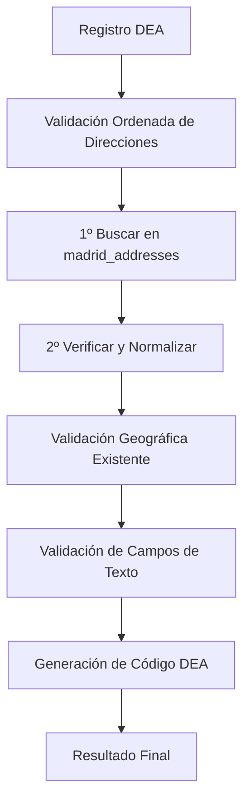

# Sistema de Validación de Direcciones Ordenada

## Descripción

Se ha implementado un nuevo sistema de validación de direcciones que sigue un orden específico para verificar los datos de direcciones en los registros DEA contra la base de datos oficial del Ayuntamiento de Madrid.

## Orden de Validación

### 1º Paso: Búsqueda en Base de Datos Oficial

El sistema busca la dirección (tipo de vía + nombre de vía + número de vía) en las tablas oficiales del Ayuntamiento de Madrid siguiendo esta secuencia:

1. **Búsqueda exacta completa**: Busca coincidencia exacta de tipo de vía, nombre de vía y número
2. **Búsqueda exacta sin número**: Si no encuentra coincidencia completa, busca solo tipo y nombre de vía
3. **Búsqueda con tolerancia**: Utiliza algoritmos de similitud para encontrar direcciones parecidas

### 2º Paso: Verificación y Normalización

Una vez encontrada la dirección oficial, el sistema verifica y normaliza:

1. **Nombre de vía**: Compara el nombre escrito manualmente vs el oficial
2. **Código postal**: Verifica que coincida con el de la base de datos oficial
3. **Distrito**: Verifica que el distrito corresponda con el oficial

## Archivos Implementados

### `src/services/addressValidationService.ts`

Servicio principal que implementa la validación ordenada:

- **`validateAddressInOrder()`**: Método principal que ejecuta los dos pasos de validación
- **`searchInOfficialDatabase()`**: Implementa el paso 1 de búsqueda
- **`verifyAndNormalizeAddress()`**: Implementa el paso 2 de verificación

### Interfaces Principales

```typescript
interface OrderedAddressValidation {
  step1_officialSearch: AddressSearchResult;
  step2_verification: AddressVerificationResult;
  overallResult: {
    isValid: boolean;
    needsReview: boolean;
    corrections: string[];
    confidence: number;
    recommendedActions: string[];
  };
}
```

## Integración con el Sistema Existente

### Modificaciones en `deaValidationService.ts`

El servicio principal de validación DEA ahora incluye:

1. **Nueva propiedad**: `orderedAddressValidation` en `DeaValidationResult`
2. **Llamada al nuevo servicio**: Se ejecuta antes de la validación geográfica existente
3. **Compatibilidad**: Mantiene toda la funcionalidad existente

### Flujo de Validación Actualizado



## Características Técnicas

### Algoritmos de Búsqueda

1. **Búsqueda exacta**: Utiliza coincidencias exactas insensibles a mayúsculas
2. **Normalización de texto**: Elimina acentos, puntuación y normaliza espacios
3. **Distancia de Levenshtein**: Para calcular similitud entre strings
4. **Sistema de confianza**: Asigna puntuaciones de confianza a los resultados

### Manejo de Errores

- **Direcciones no encontradas**: Se marcan para revisión manual
- **Múltiples coincidencias**: Se ordenan por confianza
- **Errores de base de datos**: Se manejan graciosamente sin interrumpir el flujo

## Beneficios del Nuevo Sistema

1. **Orden específico**: Sigue exactamente el flujo solicitado
2. **Mayor precisión**: Búsqueda más estructurada en datos oficiales
3. **Mejor normalización**: Comparación directa con nombres oficiales
4. **Trazabilidad**: Cada paso está documentado en el resultado
5. **Compatibilidad**: No rompe funcionalidad existente

## Uso del Sistema

### Validación Individual

```typescript
import { addressValidationService } from './services/addressValidationService';

const result = await addressValidationService.validateAddressInOrder(
  'Calle',           // tipo de vía
  'Gran Vía',        // nombre de vía
  '1',               // número de vía
  '28013',           // código postal
  '1. Centro'        // distrito
);

console.log('Paso 1:', result.step1_officialSearch);
console.log('Paso 2:', result.step2_verification);
console.log('Resultado:', result.overallResult);
```

### Integración con Validación DEA

```typescript
import { deaValidationService } from './services/deaValidationService';

const validation = await deaValidationService.validateDeaRecord(recordId);

// Acceso a la nueva validación ordenada
console.log('Validación ordenada:', validation.orderedAddressValidation);

// Acceso a validación existente (mantiene compatibilidad)
console.log('Validación geográfica:', validation.geographic);
```

## Configuración de Base de Datos

El sistema utiliza las siguientes tablas de la base de datos oficial de Madrid:

- **`madrid_addresses`**: Tabla principal con direcciones completas
- **`madrid_streets`**: Información de calles
- **`madrid_street_districts`**: Relación calles-distritos

## Próximos Pasos

1. **Pruebas**: Validar el sistema con datos reales
2. **Optimización**: Mejorar performance de búsquedas
3. **Interfaz**: Actualizar UI para mostrar resultados ordenados
4. **Métricas**: Implementar seguimiento de precisión del sistema

## Notas Técnicas

- **Performance**: Las búsquedas están limitadas para evitar sobrecarga
- **Memoria**: Se utilizan índices en base de datos para optimizar consultas
- **Escalabilidad**: El sistema soporta procesamiento en lotes
- **Mantenimiento**: Logs detallados para debugging y monitoreo
