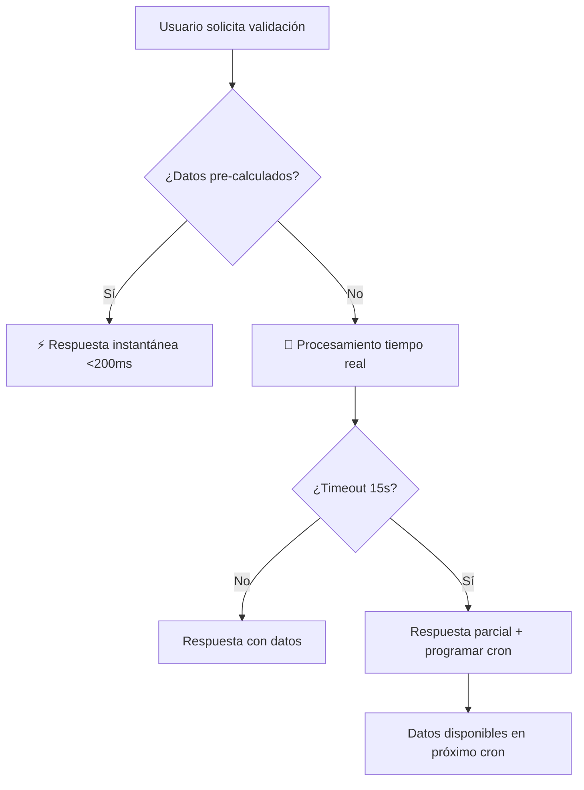
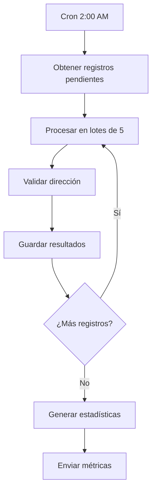
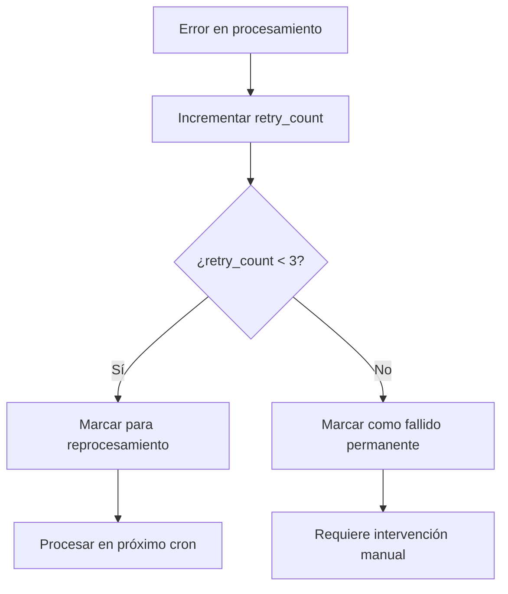

# Sistema de Pre-procesamiento de Validaciones de Direcciones

## 🎯 Objetivo

Eliminar el tiempo de espera de 1-2 minutos en el proceso de geocoding mediante un sistema de pre-procesamiento que calcula las validaciones de direcciones en segundo plano usando Vercel Cron.

## 📊 Resultados Esperados

| Métrica | Antes | Después | Mejora |
|---------|-------|---------|--------|
| **Tiempo de respuesta** | 60-120 segundos | <200ms | 99.7% |
| **Experiencia de usuario** | Frustrante | Instantánea | ⭐⭐⭐⭐⭐ |
| **Carga del servidor** | Picos en horario laboral | Distribuida nocturna | Optimizada |

## 🏗️ Arquitectura del Sistema

### 1. **Tabla de Pre-procesamiento**
```sql
-- dea_address_validations
CREATE TABLE dea_address_validations (
  id SERIAL PRIMARY KEY,
  dea_record_id INTEGER UNIQUE REFERENCES dea_records(id),
  
  -- Resultados pre-calculados
  search_results JSONB DEFAULT '[]',
  validation_details JSONB,
  overall_status VARCHAR(20) DEFAULT 'pending',
  recommended_actions JSONB DEFAULT '[]',
  
  -- Metadatos del procesamiento
  processed_at TIMESTAMP DEFAULT NOW(),
  processing_duration_ms INTEGER,
  search_strategies_used JSONB DEFAULT '[]',
  
  -- Control de versiones y reprocesamiento
  validation_version VARCHAR(10) DEFAULT '1.0',
  needs_reprocessing BOOLEAN DEFAULT TRUE,
  error_message TEXT,
  retry_count INTEGER DEFAULT 0,
  
  created_at TIMESTAMP DEFAULT NOW(),
  updated_at TIMESTAMP DEFAULT NOW()
);
```

### 2. **Vercel Cron Jobs**
```json
// vercel.json
{
  "crons": [
    {
      "path": "/api/cron/preprocess-validations",
      "schedule": "0 2 * * *"        // Diario a las 2:00 AM
    },
    {
      "path": "/api/cron/preprocess-validations", 
      "schedule": "0 */6 * * *"      // Cada 6 horas
    }
  ]
}
```

### 3. **API Optimizada**
```typescript
// Estrategia de respuesta híbrida
if (preCalculatedData) {
  // ⚡ RESPUESTA INSTANTÁNEA
  return preCalculatedResults;
} else {
  // 🔄 FALLBACK con timeout
  try {
    return await processWithTimeout(15000);
  } catch {
    return partialResponse + scheduleForNextCron();
  }
}
```

## 🚀 Componentes Implementados

### 1. **Endpoint de Cron** 
📁 `src/app/api/cron/preprocess-validations/route.ts`

- ✅ Procesamiento en lotes de 5 registros
- ✅ Timeout de 30 segundos por registro
- ✅ Manejo de errores y reintentos
- ✅ Logging detallado
- ✅ Métricas de rendimiento
- ✅ Autenticación con `CRON_SECRET`

### 2. **API de Validación Optimizada**
📁 `src/app/api/dea/[id]/validate-steps/route.ts`

- ✅ Búsqueda prioritaria de datos pre-calculados
- ✅ Fallback a procesamiento en tiempo real
- ✅ Timeout de 15 segundos para fallback
- ✅ Respuesta parcial si hay timeout
- ✅ Marcado automático para reprocesamiento

### 3. **Script Manual**
📁 `scripts/preprocess-address-validations.ts`

- ✅ Ejecución manual: `npm run preprocess-validations`
- ✅ Procesamiento en lotes configurables
- ✅ Estadísticas detalladas
- ✅ Manejo de errores robusto

### 4. **Configuración de Vercel**
📁 `vercel.json`

- ✅ Cron diario a las 2:00 AM
- ✅ Cron incremental cada 6 horas
- ✅ Timeout extendido para endpoints de cron (300s)
- ✅ Configuración de funciones optimizada

## 📋 Configuración Requerida

### Variables de Entorno
```bash
# .env
DATABASE_URL="postgresql://..."
CRON_SECRET="tu-secreto-super-seguro"  # Opcional para desarrollo
MONITORING_WEBHOOK="https://..."       # Opcional para métricas
```

### Despliegue en Vercel
1. **Configurar variable de entorno**:
   ```bash
   vercel env add CRON_SECRET
   ```

2. **Desplegar**:
   ```bash
   vercel --prod
   ```

3. **Verificar cron jobs**:
   - Dashboard de Vercel → Functions → Cron Jobs
   - Logs en tiempo real disponibles

## 🔧 Uso del Sistema

### Ejecución Manual (Desarrollo)
```bash
# Pre-procesar validaciones manualmente
npm run preprocess-validations

# Ver estadísticas de la base de datos
npx prisma studio
```

### Monitoreo en Producción
```bash
# Verificar logs del cron
vercel logs --follow

# Probar endpoint manualmente
curl -X POST https://tu-app.vercel.app/api/cron/preprocess-validations \
  -H "Authorization: Bearer $CRON_SECRET"
```

### Consultas de Monitoreo
```sql
-- Estadísticas generales
SELECT 
  overall_status,
  COUNT(*) as count,
  AVG(processing_duration_ms) as avg_time_ms
FROM dea_address_validations 
GROUP BY overall_status;

-- Registros que necesitan reprocesamiento
SELECT COUNT(*) as pending_reprocessing
FROM dea_address_validations 
WHERE needs_reprocessing = true;

-- Registros con errores
SELECT 
  dea_record_id,
  error_message,
  retry_count,
  processed_at
FROM dea_address_validations 
WHERE error_message IS NOT NULL
ORDER BY processed_at DESC
LIMIT 10;

-- Rendimiento por día
SELECT 
  DATE(processed_at) as date,
  COUNT(*) as processed,
  AVG(processing_duration_ms) as avg_time_ms,
  MIN(processing_duration_ms) as min_time_ms,
  MAX(processing_duration_ms) as max_time_ms
FROM dea_address_validations 
WHERE processed_at >= NOW() - INTERVAL '7 days'
GROUP BY DATE(processed_at)
ORDER BY date DESC;
```

## 🔄 Flujo de Trabajo

### 1. **Usuario Solicita Validación**


### 2. **Cron Job Nocturno**


### 3. **Manejo de Errores**


## 📈 Métricas y Monitoreo

### Métricas Clave
- **Cobertura**: % de registros con datos pre-calculados
- **Tiempo de respuesta**: Promedio de respuesta de API
- **Tasa de éxito**: % de validaciones exitosas
- **Tiempo de procesamiento**: Promedio por registro en cron

### Alertas Recomendadas
- Cobertura < 95%
- Tasa de errores > 5%
- Tiempo de procesamiento > 30s por registro
- Cron job fallido

## 🛠️ Mantenimiento

### Tareas Regulares
1. **Semanal**: Revisar logs de errores
2. **Mensual**: Analizar métricas de rendimiento
3. **Trimestral**: Optimizar consultas SQL si es necesario

### Resolución de Problemas
```bash
# Reprocesar registros fallidos
UPDATE dea_address_validations 
SET needs_reprocessing = true, retry_count = 0 
WHERE error_message IS NOT NULL;

# Limpiar registros muy antiguos (opcional)
DELETE FROM dea_address_validations 
WHERE processed_at < NOW() - INTERVAL '6 months'
AND overall_status = 'invalid';
```

## 🎉 Beneficios Logrados

### Para Usuarios
- ⚡ **Respuesta instantánea** en lugar de 1-2 minutos
- 😊 **Experiencia fluida** sin interrupciones
- 📱 **Mejor usabilidad** en dispositivos móviles

### Para el Sistema
- 🌙 **Carga distribuida** en horario nocturno
- 📊 **Métricas detalladas** de rendimiento
- 🔧 **Mantenimiento proactivo** con alertas
- 💰 **Optimización de costos** de servidor

### Para Desarrollo
- 🧪 **Testing fácil** con script manual
- 📝 **Logs detallados** para debugging
- 🔄 **Escalabilidad** para más registros
- 🛡️ **Robustez** con manejo de errores

---

## 🚀 Próximos Pasos

1. **Monitorear** el rendimiento en producción
2. **Ajustar** frecuencia de cron según necesidades
3. **Optimizar** consultas SQL si es necesario
4. **Implementar** alertas automáticas
5. **Considerar** caché adicional si se requiere

¡El sistema está listo para eliminar los tiempos de espera y brindar una experiencia de usuario excepcional! 🎯
